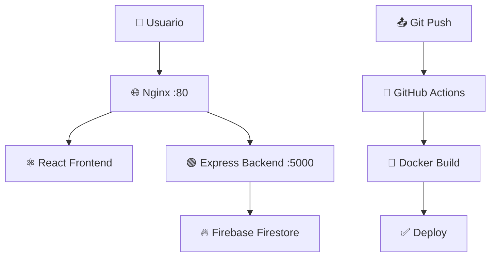

# 📦 CloudStock Pro

> Plataforma cloud para la gestión inteligente de inventarios — Computación en la Nube


## 🚀 Ejecutar con Docker

```bash
# Clonar el repositorio
git clone https://github.com/TU_USUARIO/cloudstock-pro.git
cd cloudstock-pro

# (Opcional) Configurar Firebase
cp .env.example .env
# Editar .env con tus credenciales Firebase

# Levantar el sistema
docker compose up --build -d
```

Abrir en el navegador: **http://localhost**

> ⚡ Sin configurar Firebase, el sistema inicia en **modo demo** con datos de ejemplo.

---

## 🛠️ Ejecutar en modo desarrollo

```bash
# Backend
cd backend
npm install
npm run dev    # http://localhost:5000

# Frontend (nueva terminal)
cd frontend
npm install
npm run dev    # http://localhost:3000
```

---

## 🏗️ Arquitectura

```
Usuario → Nginx (:80) → Frontend React (:3000)
                      → Backend Express (:5000) → Firebase Firestore
```



---

## 🔥 Configurar Firebase

1. Ir a [console.firebase.google.com](https://console.firebase.google.com)
2. Crear proyecto → Habilitar **Firestore Database**
3. Configuración → Cuentas de servicio → **Generar nueva clave privada**
4. Copiar los valores al archivo `.env`

---

## 📁 Estructura del Proyecto

```
cloudstock-pro/
├── backend/
│   ├── config/firebase.js        # Firebase Admin SDK
│   ├── controllers/              # Lógica CRUD
│   ├── routes/                   # Endpoints API
│   └── server.js                 # Servidor Express
├── frontend/
│   └── src/
│       ├── pages/                # Dashboard, Productos, Reportes, DevOps
│       ├── components/           # Sidebar, KPICard
│       └── services/api.js       # Cliente HTTP
├── docker/
│   ├── backend.Dockerfile
│   ├── frontend.Dockerfile
│   └── nginx.conf
├── .github/workflows/ci-cd.yml   # Pipeline CI/CD
└── docker-compose.yml
```

---

## 📡 API Endpoints

| Método | Ruta | Descripción |
|--------|------|-------------|
| GET | /health | Estado del servidor |
| GET | /api/products | Listar productos |
| POST | /api/products | Crear producto |
| PUT | /api/products/:id | Actualizar producto |
| DELETE | /api/products/:id | Eliminar producto |
| GET | /api/products/stats | Estadísticas |

---

## 🎓 Universidad Privada San Juan Bautista — Computación en la Nube
